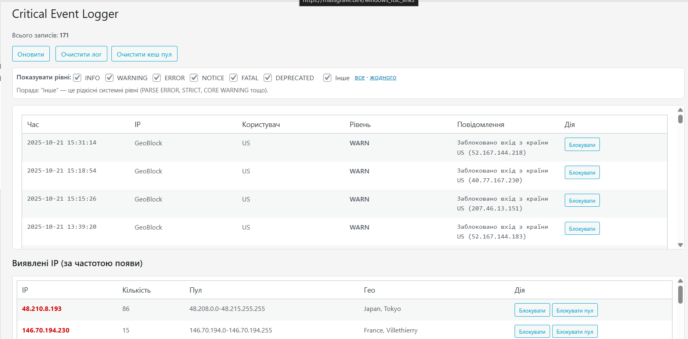
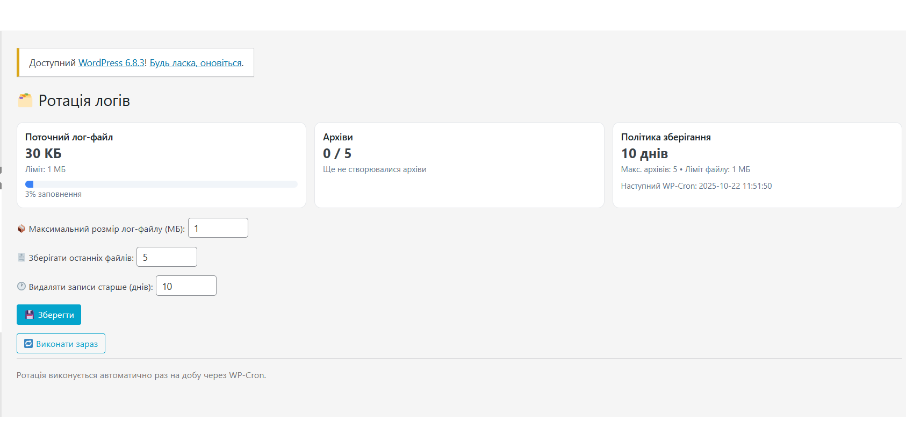
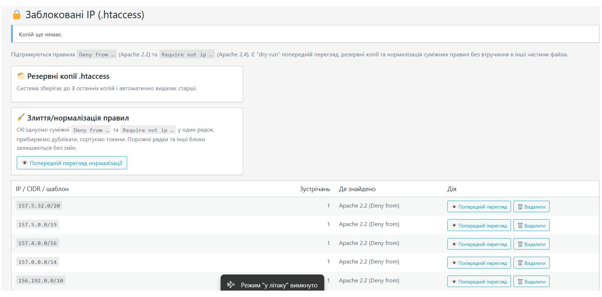
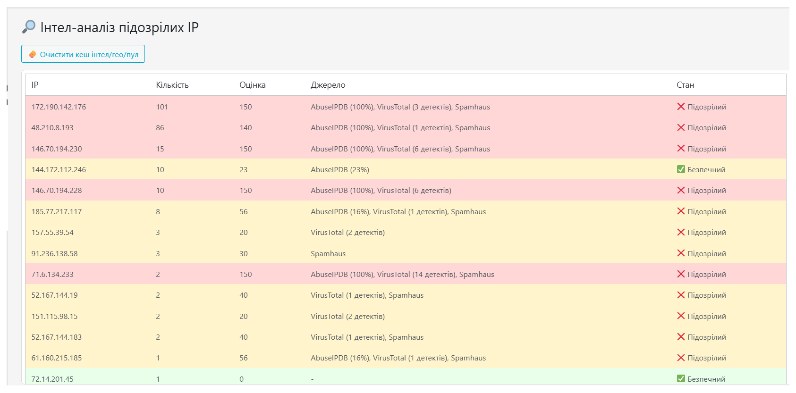
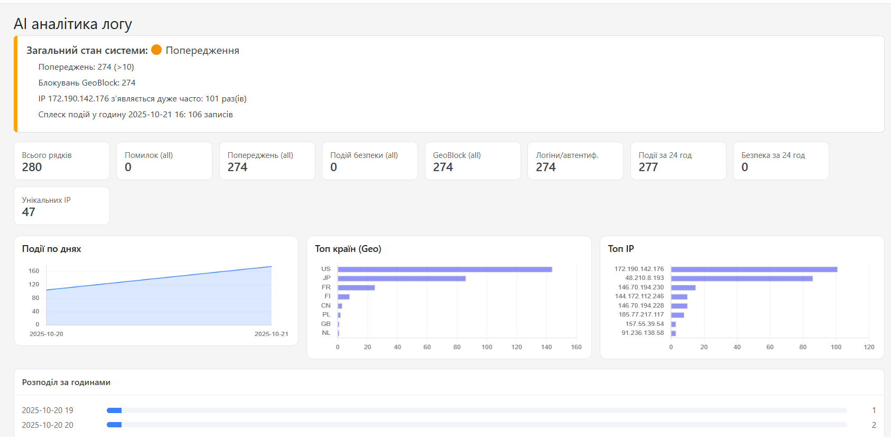

# Critical Event Logger for WordPress

[](#license)
[](#)
[](#)

> **Коротко:** критичний журнал подій WordPress із зручним переглядом, фільтрами рівнів, ротацією логів, геоблокуванням, інтеграцією з IP‑інтелем (AbuseIPDB/VirusTotal/Spamhaus/CrowdSec) та керуванням `.htaccess`‑блоклистом. Плагін орієнтований на безпечну роботу на продакшні та дає інструменти для швидкого реагування на інциденти.

---

## Зміст
- [Особливості](#особливості)
- [Вимоги](#вимоги)
- [Встановлення](#встановлення)
- [Оновлення до нових версій](#оновлення-до-нових-версій)
- [Швидкий старт](#швидкий-старт)
- [Налаштування](#налаштування)
  - [Рівні логів та фільтри](#рівні-логів-та-фільтри)
  - [Зберігання та ротація](#зберігання-та-ротація)
  - [Геоблокування](#геоблокування)
  - [`.htaccess` блоклист](#htaccess-блоклист)
  - [IP‑інтел та інтеграції](#ipінтел-та-інтеграції)
  - [AI‑аналіз (опційно)](#aiаналіз-опційно)
- [Безпека](#безпека)
- [Налагодження та поради](#налагодження-та-поради)
- [Скріншоти](#скріншоти)
- [Зміни](#зміни)
- [Ліцензія](#ліцензія)

---

## Особливості

- **Логування ключових подій**: успішні/невдалі входи, зміни постів/термінів, коментарі, 404/REST/XML‑RPC, події плагінів/тем, форма Contact Form 7 та ін.
- **Перегляд журналу** у адмінці з живим оновленням, пошуком, фільтрами за рівнями/користувачем/IP.
- **Ротація логів** за розміром/віком з щоденним WP‑Cron завданням.
- **Геоблокування** запитів за країнами (із кешами та запасними джерелами GEO/IP).
- **Керування `.htaccess` блоклистом**: попередній перегляд, бекап, додавання/видалення IP під Apache 2.2/2.4 синтаксис.
- **IP‑інтел** (AbuseIPDB, VirusTotal, Spamhaus, CrowdSec) — **опційно** з кешуванням і обмеженням таймаутів.
- **Легка інтеграція**: префіксовані хуки/фільтри `critical_logger_*`, захист nonces + capability‑перевірки.
- **Продакшн‑орієнтовано**: блокування доступу до каталогу логів, file locks при записі, обмежений tail‑читач.

> **Примітка:** Деякі можливості (AI‑аналіз, інтеграції із зовнішніми сервісами) вимикаються за замовчуванням і вмикаються лише за наявності ключів/API‑конфігурації.

---

## Вимоги

- WordPress **6.0+** (рекомендовано 6.3+)
- PHP **7.2+** (рекомендовано 8.1+)
- Веб‑сервер Apache/Nginx. Для керування `.htaccess` потрібен Apache з `mod_authz_core` (2.4) або сумісністю 2.2.
- Доступ на запис до каталогу логів (див. нижче).

---

## Встановлення

### Через релізний ZIP
1. Завантажте архів останнього релізу `critical-event-logger.zip` зі сторінки **Releases**.
2. В адмінці WordPress перейдіть **Плагіни → Додати новий → Завантажити плагін**, виберіть ZIP → **Встановити** → **Активувати**.

---

## Швидкий старт

1. Активуйте плагін.
2. Зайдіть до меню **Інструменти → Critical Event Logger** (або **Налаштування → Critical Event Logger**, залежно від конфігурації меню).
3. Відкрийте вкладку **Логи**, увімкніть потрібні **рівні** та вкажіть **ліміти зберігання**.
4. (Опційно) Налаштуйте **Geo/IP** та **інтеграції** (API‑ключі).
5. Перевірте, що **каталог логів недоступний напряму** з веба (див. розділ «Безпека»).

---

## Налаштування

### Рівні логів та фільтри
- Оберіть критичність подій (напр., `INFO`, `NOTICE`, `WARNING`, `ERROR`, `CRITICAL`).
- Фільтруйте за IP, користувачем, підсистемою (логіни, коментарі, записи тощо).
- Миттєве оновлення таблиці логів у адмінці.

### Зберігання та ротація
- За замовчуванням логи зберігаються у `wp-content/plugins/critical-logger/logs/`. Рекомендовано перенести до:
  `wp-content/uploads/critical-logger/` (безпечніше під час оновлень).
- Увімкніть **ротацію** за розміром/віком. Плагін реєструє щоденне WP‑Cron завдання для обслуговування.
- Права доступу: каталог — `0755/0750`, файли — `0644/0640` (залежно від хостингу).

### Геоблокування
- Блокуйте або позначайте трафік із вибраних країн.
- Працює з кешами і fallback‑сервісами GEO/IP, щоб мінімізувати затримки.

### `.htaccess` блоклист
- Додавайте/видаляйте IP‑адреси з блоклиста через адмінку.
- Підтримка Apache **2.4** (`Require not ip …`) і **2.2** (`Deny from …`).
- Перед змінами створюється **бекап**. Доступний **попередній перегляд**.

### IP‑інтел та інтеграції
- Підтримуються: **AbuseIPDB**, **VirusTotal**, **Spamhaus**, **CrowdSec**.
- Налаштування ключів у розділі **Integrations** (або відповідній вкладці налаштувань).
- Результати кешуються (з таймаутами), щоб зменшити навантаження і кількість зовнішніх запитів.

### AI‑аналіз (опційно)
- Дозволяє швидко узагальнювати великі журнали, виявляти патерни інцидентів.
- Потрібен **OpenAI API key** (або сумісний backend). Функція вимкнена за замовчуванням.

---

## Безпека

- Адмін‑ендпоїнти захищені **nonce** та перевіркою capability (зазвичай `manage_options`).  
- Запис у файл використовує **file locks** (`LOCK_EX`). Tail‑читач обмежує обсяг.
- **Захист каталогу логів.** Для Apache додайте `.htaccess` у каталог логів:

```apache
# Apache 2.4+
<IfModule mod_authz_core.c>
  Require all denied
</IfModule>
# Back-compat для 2.2
<IfModule !mod_authz_core.c>
  Order allow,deny
  Deny from all
</IfModule>
```

- **Зовнішні сервіси:** Увімкнення IP‑інтелу/AI відправляє хешовані або мінімально необхідні дані. Переконайтеся, що це відповідає вашій політиці приватності.
- **Whois fallback:** Виклики `shell_exec('whois')` можуть бути вимкнені на хостингу. За потреби відключіть або дозвольте цей шлях через константу.

---

## Налагодження та поради

- **Порожня/величезна таблиця логів:** перевірте права на каталог, WP‑Cron, ліміти ротації.
- **`.htaccess` не змінюється:** переконайтеся, що працює Apache, немає конфліктів у конфігурації, та що у веб‑процесу достатньо прав.
- **Повільні інтеграції:** зменшіть таймаути, увімкніть кеші, відключіть непотрібні сервіси.
- **Збирання релізу:** не включайте `logs/` і dev‑каталоги у релізний ZIP (використовуйте `.gitattributes` з `export-ignore`).

---

## Скріншоти

1. **Панель логів** — фільтри, пошук, live-оновлення.  
   

2. **Налаштування ротації** — ліміти за віком/розміром.  
   

3. **.htaccess блоклист** — прев’ю й бекап.  
   

4. **IP-інтел** — коротка довідка по адресі.  
   

5. **AI аналітика логу** — інсайти.  
   

---
## Зміни

Див. сторінку **[Releases](../../releases)** для повного списку змін.  
Поточна версія: **2.1.2**.

---

## Ліцензія

```
Critical Event Logger — helper module
Copyright © 2025 Казмірчук Андрій
License: GPLv2 or later
License URI: https://www.gnu.org/licenses/gpl-2.0.html
```

Цей плагін поширюється під ліцензією **GPL v2 або пізнішою**. Див. файл LICENSE або посилання вище.
