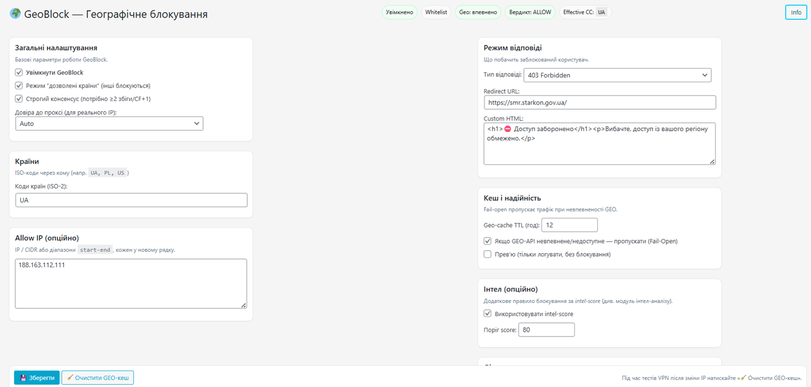

# Critical Event Logger for WordPress

[](#license)
[](#)
[](#)

> **Коротко:** критичний журнал подій WordPress із зручним переглядом, фільтрами рівнів, ротацією логів, геоблокуванням, інтеграцією з IP‑інтелем (AbuseIPDB/VirusTotal/Spamhaus) та керуванням `.htaccess`‑блоклистом. Плагін орієнтований на безпечну роботу на продакшні та дає інструменти для швидкого реагування на інциденти.

---

## Зміст
- [Особливості](#особливості)
- [Вимоги](#вимоги)
- [Встановлення](#встановлення)
- [Оновлення до нових версій](#оновлення-до-нових-версій)
- [Швидкий старт](#швидкий-старт)
- [Налаштування](#налаштування)
  - [Рівні логів та фільтри](#рівні-логів-та-фільтри)
  - [Зберігання та ротація](#зберігання-та-ротація)
  - [Геоблокування](#геоблокування)
  - [`.htaccess` блоклист](#htaccess-блоклист)
  - [IP‑інтел та інтеграції](#ipінтел-та-інтеграції)
  - [AI‑аналіз (опційно)](#aiаналіз-опційно)
- [Безпека](#безпека)
- [Налагодження та поради](#налагодження-та-поради)
- [Скріншоти](#скріншоти)
- [Зміни](#зміни)
- [Ліцензія](#ліцензія)

---

## Особливості

- **Логування ключових подій**: успішні/невдалі входи, зміни постів/термінів, коментарі, 404/REST/XML‑RPC, події плагінів/тем, форма Contact Form 7 та ін.
- **Перегляд журналу** у адмінці з живим оновленням, пошуком, фільтрами за рівнями/користувачем/IP.
- **Ротація логів** за розміром/віком з щоденним WP‑Cron завданням.
- **Геоблокування** запитів за країнами (із кешами та запасними джерелами GEO/IP).
- **Керування `.htaccess` блоклистом**: попередній перегляд, бекап, додавання/видалення IP під Apache 2.2/2.4 синтаксис.
- **IP‑інтел** (AbuseIPDB, VirusTotal, Spamhaus) — **опційно** з кешуванням і обмеженням таймаутів.
- **Боти-винятки**: білий список пошукових ботів (Googlebot, Bingbot та ін.) з rDNS-перевіркою та інтеграцією з `.htaccess` і GeoBlock.
- **Легка інтеграція**: префіксовані хуки/фільтри `critical_logger_*`, захист nonces + capability‑перевірки.
- **Продакшн‑орієнтовано**: блокування доступу до каталогу логів (`wp-content/uploads/critical-event-logger/logs/`), file locks при записі, обмежений tail‑читач.

> **Примітка:** Деякі можливості (AI‑аналіз, інтеграції із зовнішніми сервісами) вимикаються за замовчуванням і вмикаються лише за наявності ключів/API‑конфігурації.

---

## Вимоги

- WordPress **6.0+** (рекомендовано 6.3+)
- PHP **7.2+** (рекомендовано 8.1+)
- Веб‑сервер Apache/Nginx. Для керування `.htaccess` потрібен Apache з `mod_authz_core` (2.4) або сумісністю 2.2.
- Доступ на запис до каталогу логів (див. нижче).

---

## Встановлення

### Через релізний ZIP
1. Завантажте архів останнього релізу `critical-event-logger.zip` зі сторінки **Releases**.
2. В адмінці WordPress перейдіть **Плагіни → Додати новий → Завантажити плагін**, виберіть ZIP → **Встановити** → **Активувати**.

---

## Швидкий старт

1. Активуйте плагін.
2. Зайдіть до меню **Інструменти → Critical Event Logger** (або **Налаштування → Critical Event Logger**, залежно від конфігурації меню).
3. Відкрийте вкладку **Логи**, увімкніть потрібні **рівні** та вкажіть **ліміти зберігання**.
4. (Опційно) Налаштуйте **Geo/IP** та **інтеграції** (API‑ключі).
5. Перевірте, що **каталог логів недоступний напряму** з веба (див. розділ «Безпека»).

---

## Налаштування

### Рівні логів та фільтри
- Оберіть критичність подій (напр., `INFO`, `NOTICE`, `WARNING`, `ERROR`, `CRITICAL`).
- Фільтруйте за IP, користувачем, підсистемою (логіни, коментарі, записи тощо).
- Миттєве оновлення таблиці логів у адмінці.

### Зберігання та ротація
- Логи зберігаються у `wp-content/uploads/critical-event-logger/logs/`.
- Увімкніть **ротацію** за розміром/віком. Плагін реєструє щоденне WP‑Cron завдання для обслуговування.
- Права доступу: каталог — `0755/0750`, файли — `0644/0640` (залежно від хостингу).

### Геоблокування
- Блокуйте або позначайте трафік із вибраних країн.
- Працює з кешами і fallback‑сервісами GEO/IP, щоб мінімізувати затримки.
- За наявності платного ключа `pro.ip-api.com` додайте у `wp-config.php`:
  ```php
  define('CRIT_IPAPI_PRO_KEY', 'ваш_ключ');
  ```

### `.htaccess` блоклист
- Додавайте/видаляйте IP‑адреси з блоклиста через адмінку.
- Підтримка Apache **2.4** (`Require not ip …`) і **2.2** (`Deny from …`).
- Перед змінами створюється **бекап**. Доступний **попередній перегляд**.

### IP‑інтел та інтеграції
- Підтримуються: **AbuseIPDB**, **VirusTotal**, **Spamhaus**.
- Налаштування ключів у розділі **Integrations** (або відповідній вкладці налаштувань).
- Результати кешуються (з таймаутами), щоб зменшити навантаження і кількість зовнішніх запитів.

### AI‑аналіз (опційно)
- Дозволяє швидко узагальнювати великі журнали, виявляти патерни інцидентів.
- Потрібен **OpenAI API key** (або сумісний backend). Функція вимкнена за замовчуванням.

---

## Безпека

- Адмін‑ендпоїнти захищені **nonce** та перевіркою capability (зазвичай `manage_options`).
- Запис у файл використовує **file locks** (`LOCK_EX`). Tail‑читач обмежує обсяг.
- **Захист каталогу логів.** Для Apache додайте `.htaccess` у каталог логів:

```apache
# Apache 2.4+
<IfModule mod_authz_core.c>
  Require all denied
</IfModule>
# Back-compat для 2.2
<IfModule !mod_authz_core.c>
  Order allow,deny
  Deny from all
</IfModule>
```

- **Зовнішні сервіси:** Увімкнення IP‑інтелу/AI відправляє хешовані або мінімально необхідні дані. Переконайтеся, що це відповідає вашій політиці приватності.
- **Whois fallback:** Виклики `shell_exec('whois')` **вимкнені за замовчуванням**. Щоб увімкнути, додайте у `wp-config.php`:
  ```php
  define('CRIT_ALLOW_SHELL_WHOIS', true);           // вмикає shell whois
  define('CRIT_WHOIS_BIN', '/usr/bin/whois');        // шлях до бінарника (необовʼязково)
  ```

---

## Налагодження та поради

- **Порожня/величезна таблиця логів:** перевірте права на каталог, WP‑Cron, ліміти ротації.
- **`.htaccess` не змінюється:** переконайтеся, що працює Apache, немає конфліктів у конфігурації, та що у веб‑процесу достатньо прав.
- **Повільні інтеграції:** зменшіть таймаути, увімкніть кеші, відключіть непотрібні сервіси.
- **Збирання релізу:** не включайте `logs/` і dev‑каталоги у релізний ZIP (використовуйте `.gitattributes` з `export-ignore`).

---

## Скріншоти

1. **Панель логів** — фільтри, пошук, live-оновлення.  
   

2. **Налаштування ротації** — ліміти за віком/розміром.  
   

3. **.htaccess блоклист** — прев'ю й бекап.  
   

4. **IP-інтел** — коротка довідка по адресі.  
   

5. **AI аналітика логу** — інсайти.  
   

6. **GeoBlock — налаштування та діагностика**.  
   

7. **Боти-винятки** — керування білим списком ботів.  
   

---

## Зміни

Див. сторінку **[Releases](../../releases)** для повного списку змін.  
Поточна версія: **2.1.1**.

---

## Ліцензія

```
Critical Event Logger — helper module
Copyright © 2025 Казмірчук Андрій
License: GPLv2 or later
License URI: https://www.gnu.org/licenses/gpl-2.0.html
```

Цей плагін поширюється під ліцензією **GPL v2 або пізнішою**. Див. файл LICENSE або посилання вище.

---

### Швидкий чекліст налаштування

# Critical Event Logger — Швидкий чекліст налаштування

1) **Захист каталогу логів**
   - [ ] Додано Nginx `location` deny або Apache `<Directory> Require all denied`.
   - [ ] `curl -I https://site/wp-content/uploads/critical-event-logger/logs/events.log` → 403/404.

2) **Права й користувачі**
   - [ ] Власник каталогу логів — веб-користувач (www-data/nginx).
   - [ ] Права: папки `750`, файли `640`.

3) **Ротація**
   - [ ] Макс. розмір 10–20 МБ, архіви 7–14, вік 30–90 днів.
   - [ ] Перевірено створення архівів та видалення старих.

4) **GeoBlock**
   - [ ] Спершу режим Preview.
   - [ ] Додані винятки (офісні CIDR, VPN, CDN).
   - [ ] Кеш 30–60 хв.

5) **Proxy / Real IP**
   - [ ] Налаштовано відновлення реальної IP на сервері (CF/Nginx).
   - [ ] Опція `trust_proxy` у налаштуваннях GeoBlock встановлена у `yes` лише за довіреного проксі (за замовчуванням — `auto`).

6) **Інтел/AI (опційно)**
   - [ ] Додано ключі AbuseIPDB / VirusTotal / OpenAI.
   - [ ] Виставлено адекватні таймаути і TTL кешів.

7) **CRON**
   - [ ] Налаштований системний cron для WP-Cron (*/15).

8) **Боти-винятки**
   - [ ] Увімкнені потрібні боти на сторінці «Боти-винятки».
   - [ ] Перевірено що `.htaccess` оновився блоком `# BEGIN CRIT-BOT-ALLOW`.

9) **Експлуатація**
   - [ ] Щоденні перегляди логів і підозрілих IP.
   - [ ] Щотижневий перегляд ротації та блок-листа.
   - [ ] Щомісячна перевірка deny-правил після апдейтів/міграцій.

### Ops README (розгорнутий гайд з експлуатації)

# Critical Event Logger — Ops README

Цей документ допоможе швидко і безпечно розгорнути та експлуатувати плагін **Critical Event Logger** для WordPress.

## Що робить плагін
- Журналює критичні та адміністративні події WordPress у файл.
- Показує логи в адмінці (AJAX-перезавантаження, фільтри, пошук).
- Ротує й архівує журнали за розміром/часом.
- Має GeoBlock за країною з «консенсусом» кількох джерел.
- Дозволяє керувати блок-листом IP у `.htaccess` (Apache 2.2/2.4).
- Робить базовий IP-інтел (AbuseIPDB, VirusTotal, Spamhaus) із кешуванням.
- Керує білим списком пошукових ботів (rDNS-перевірка + `.htaccess` інтеграція).
- (Опційно) Формує AI-огляд по логах (ключ OpenAI).
- Підтримує автооновлення з GitHub (PUC).

## Де та як зберігаються дані
- Основний журнал: `wp-content/uploads/critical-event-logger/logs/events.log`
- Архіви: `wp-content/uploads/critical-event-logger/logs/events-YYYYmmdd-HHMMSS.log`
- Кеші/сервісні файли — у транзієнтах WP та службових підпапках uploads.

> **Важливо:** `.htaccess` у каталозі логів **не працює** на Nginx. Обовʼязково закрийте доступ сервером (див. «Захист директорії логів»). Маскування PII діє тільки при відображенні в адмінці — у файлі лога зберігається «сирий» текст.

## Вимоги (рекомендації)
- WordPress 6.x+, PHP 7.4+ або 8.x.
- Модуль cURL або дозволений `WP_Http` для зовнішніх запитів (Geo/IP/інтел/AI).
- Права на запис у `wp-content/uploads` для веб-користувача.

## Встановлення
1. Завантажте плагін у директорію `wp-content/plugins/` та активуйте в адмінці.
2. Після активації плагін створить каталог логів і службові файли (`.htaccess`, `index.php`).
3. Перейдіть у **Адмінка → Інструменти → Critical Event Logger** та налаштуйте:
   - **View Logs** — перегляд/фільтрація лога.
   - **Rotation** — ліміти розміру/кількості/віку логів.
   - **GeoBlock** — країни-блок, винятки, режим (preview/блок).
   - **Intelligence** — ключі AbuseIPDB/VirusTotal, TTL кешів.
   - **.htaccess Blocklist** — додавання/видалення IP/CIDR/діапазонів.
   - **Боти-винятки** — білий список пошукових ботів з rDNS-перевіркою.
   - **API Keys** — збереження/очищення ключів сервісів та OpenAI (за потреби).

## Захист директорії логів (обовʼязково)
### Nginx
```nginx
# Блокує будь-який доступ до каталогу плагіна
location ^~ /wp-content/uploads/critical-event-logger/ {
    deny all;
    return 404;
}
```

### Apache (якщо керуєте віртуальним хостом, не .htaccess)
```apache
<Directory "/var/www/html/wp-content/uploads/critical-event-logger">
    Require all denied
</Directory>
```

> `.htaccess` у папці логів додається плагіном автоматично, але покладайтеся на серверні правила, якщо у вас Nginx або змішане оточення.

## Налаштування CRON
Плагін використовує WP-Cron. Для надійності бажано запускати WP-Cron системним планувальником:

```cron
*/15 * * * * cd /path/to/wordpress && wp cron event run --due-now >/dev/null 2>&1
```

## Рекомендовані значення ротації
- **Макс. розмір лога:** 10–20 МБ
- **Кількість архівів:** 7–14
- **Макс. вік записів:** 30–90 днів

## GeoBlock — поради
- Спочатку увімкніть **Preview**, щоб перевірити фальшпозитиви.
- Додайте винятки для власної країни та службових CIDR (офіс/VPN/CDN).
- Кеш 30–60 хв оптимальний; покладайтесь на заголовки CDN (Cloudflare) за наявності.
- За наявності платного ключа `pro.ip-api.com` додайте у `wp-config.php`:
  ```php
  define('CRIT_IPAPI_PRO_KEY', 'ваш_ключ');
  ```

## Проксі та реальна IP-адреса
Якщо сайт за довіреним проксі/CDN, налаштуйте опцію **Довіра до проксі** на сторінці GeoBlock:
- `auto` (за замовчуванням) — читає `X-Forwarded-For` лише якщо `REMOTE_ADDR` є приватним.
- `yes` — завжди довіряє `X-Forwarded-For` (лише якщо впевнені у ланцюжку проксі).
- `no` — завжди використовує `REMOTE_ADDR`.

> Не встановлюйте `yes` без необхідності — це дозволяє підміну IP через заголовок `X-Forwarded-For`.

## Інтел-аналіз IP
- **AbuseIPDB / VirusTotal / Spamhaus** — ключі вводяться на сторінці **API Keys**.
- Дані кешуються (~12 год), щоб не перевищувати ліміти.
- У звіті підсвічуються ризикові IP; блокуйте точково через `.htaccess Blocklist`.

## Конфіденційність
- В адмінці можливе маскування PII (email/IP/телефон).
- У файлі лога зберігаються реальні значення — забезпечте **серверну** заборону доступу та обмежте доступ до файлової системи.

## AI-огляд (опційно)
- Введіть ключ OpenAI, оберіть компактну модель.
- Враховуйте вартість і ліміти; тримайте таймаути адекватними до мережі.

## Видалення/очистка
- На сторінці плагіна є дії для очищення кешів і ключів.
- `uninstall.php` прибирає опції/крони/кеші/каталог логів (перевірте перед видаленням у продакшені).

## Типові проблеми та рішення
- **Журнал доступний ззовні (200 OK):** додайте серверні deny-правила (див. вище), перевірте `curl -I https://site/.../events.log` має давати 403/404.
- **Немає записів / «Permission denied»:** виправте власника каталогу (`www-data`/`nginx`) і права (`750` для папок, `640` для файлів).
- **Повільні сторінки інтел/AI:** перевірте ключі, ліміти, TTL кешів; тимчасово вимкніть ці модулі.
- **Неправильні IP за проксі:** налаштуйте відновлення реальної IP на веб-сервері (CF Real IP, `real_ip_header` у Nginx), після чого встановіть опцію `trust_proxy=yes` у налаштуваннях GeoBlock.
- **Googlebot блокується GeoBlock:** увімкніть потрібного бота на сторінці «Боти-винятки» — rDNS-перевірка підтвердить справжність і додасть виняток.
- **Multisite:** перевірте, де зберігаються логи (на рівні мережі/сайту), узгодьте ролі супер-адмінів.

## Операційний «runbook»
**Щодня:**
- Перевірте «View Logs», зверніть увагу на повторні 4xx/5xx і «підозрілі» URI.
- Прогляньте «Detected IPs» і звіт інтел при піках активності.

**Щотижня:**
- Перегляньте ротацію: архіви створюються, старі видаляються.
- Оновіть блок-лист .htaccess, заберіть помилкові спрацьовування.

**Щомісяця:**
- Перевірте deny-правила веб-сервера після оновлень/міграцій.
- Перегляньте TTL кешів для зовнішніх сервісів, ключі, ліміти та витрати.


### Процесна схема (ASCII)

```
WP Hooks & системні події
        │
        ▼
logger-hooks.php ──> critical_logger_log() ──> logger.php ──> events.log (uploads/.../logs)
        │                                                ▲
        │                                                │ LOCK_EX, .htaccess, index.php
        └──────────► (404/REST/CF7/Woo/updates/etc)
        
Адмін-панель
  critical-logger.php
    ├─ Меню «Переглянути логи» + AJAX:
    │    ├─ wp_ajax_critical_logger_log_table → tail логів, фільтри рівнів, PII-маскування (лише в UI)
    │    ├─ wp_ajax_critical_logger_detected_ips → часті IP + батч-гео/пул
    │    └─ wp_ajax_critical_logger_reload_logs → швидке оновлення
    ├─ Submenu:
    │    ├─ «Інтел-аналіз» → intel-admin.php → AbuseIPDB/VT/Spamhaus (кеш)
    │    ├─ «GeoBlock» → geoblock.php (ранній init-блокер + налаштування)
    │    ├─ «Ротація логів» → rotation.php (cron + архіви + політика зберігання)
    │    ├─ «Заблоковані IP (.htaccess)» → htaccess-blocklist.php
    │    ├─ «Боти-винятки» → bots.php (rDNS-перевірка + .htaccess інтеграція)
    │    └─ «API Keys» → seting.php
    └─ PUC: автооновлення з GitHub + локальні іконки/банери
```
